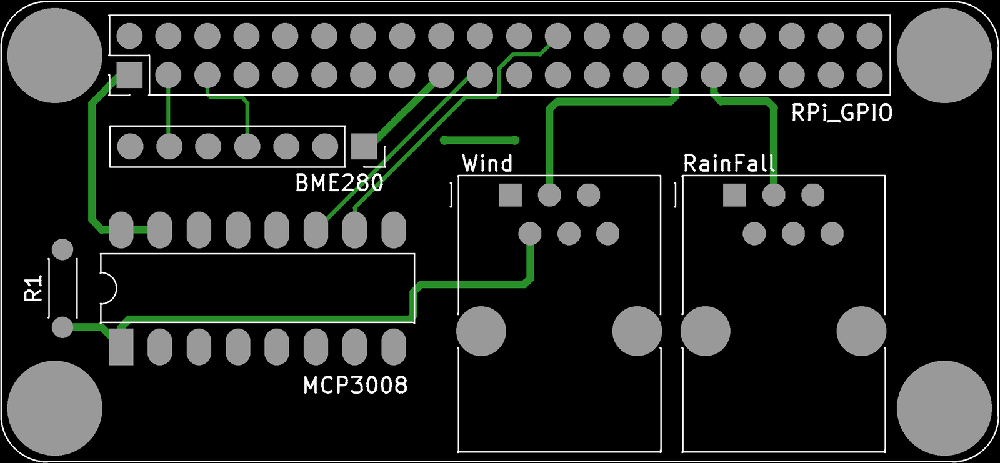
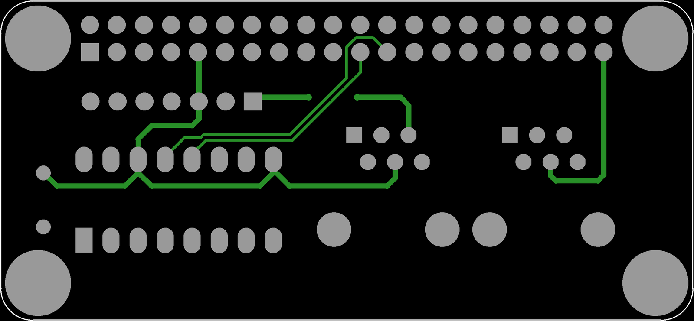
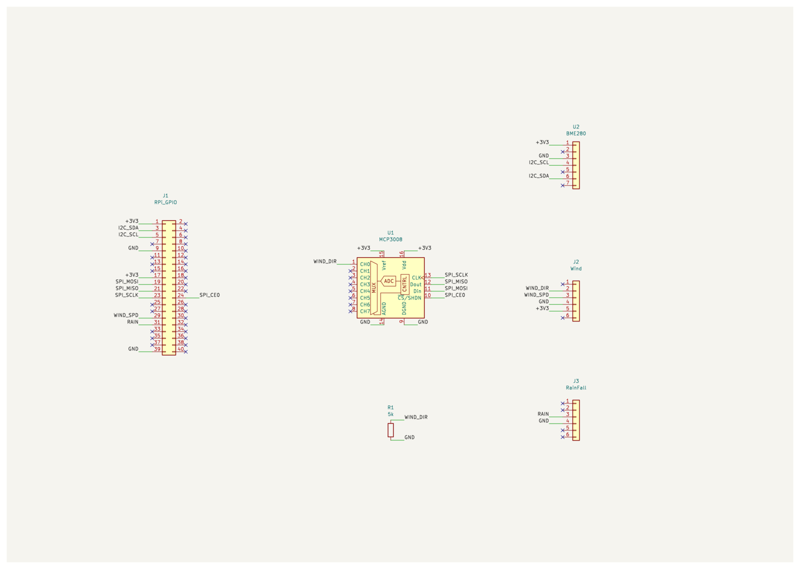
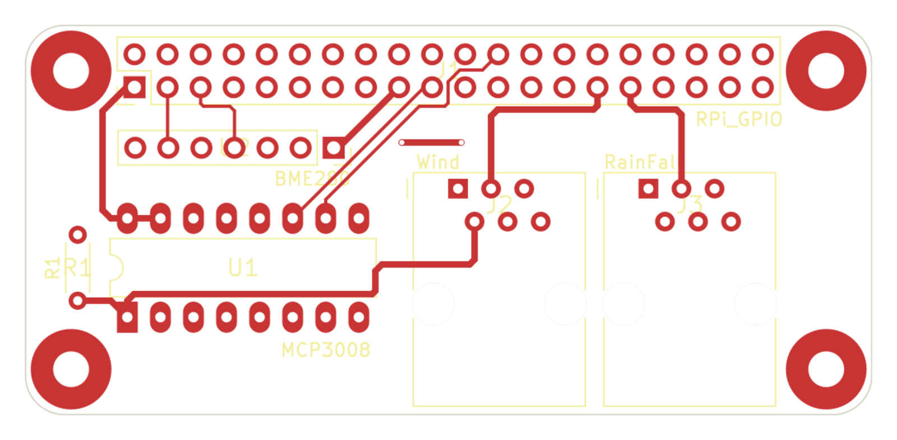

# Raspberry Pi Zero Weather Station HAT — Circuit

Design and manufacturing files for a custom Raspberry Pi Zero HAT that drives a weather station kit. Fabricated November 2020.

The board reads temperature and humidity from a **BME280**, and interfaces the kit's outdoor sensors — a wind vane, an anemometer, and a tipping-bucket rain gauge — through two RJ11/RJ12 jacks. Because the Pi has no analogue inputs, an **MCP3008** ADC on the Pi's SPI bus reads the wind vane's resistive output.

The board outline, mounting holes, and GPIO header come from [mikelawrence/RPi_Zero_pHat_Template](https://github.com/mikelawrence/RPi_Zero_pHat_Template); everything else is my own design.

**Firmware:** [pi-weather](https://github.com/irpl/pi-weather) — the Python that runs on the Pi.

| Gerber render — top | Gerber render — bottom |
|---|---|
|  |  |

## Manufacturing files

[`gerbers/`](gerbers/) holds the exact set sent to the fab: Gerbers for both copper layers, soldermask, silkscreen, board outline, plus the Excellon drill file. The board is reproducible from these as-is.

- Two-layer, 65 × 30 mm (Raspberry Pi HAT form factor)
- 87 drilled holes; 7 drill sizes from 0.40 mm to 3.25 mm
- Generated by KiCad 5.1.6

## Reconstructed schematic and layout

**The original KiCad project files were lost.** Only the Gerbers survived, so the schematic and board in [`reconstructed/`](reconstructed/) were rebuilt from them — see [`reconstructed/`](reconstructed/) for the scripts that did it.

*Full resolution: [`reconstructed/schematic.pdf`](reconstructed/schematic.pdf). The recovered layout, plotted from the reconstructed `.kicad_pcb`:*

The netlist is not a guess. Gerbers contain no connectivity, but the copper does: running a union-find over the pads and track segments (a plated hole ties the two layers together) recovers the netlist that was actually manufactured. That result is independently corroborated by the firmware — `wind_spd.py` uses `Button(5)` and the copper routes the Wind jack to GPIO5; `rain_fall.py` uses `Button(6)` and the copper routes RainFall to GPIO6; `wind_dir.py` reads `MCP3008(channel=0)` and the copper routes the vane to CH0.

### Circuit

- **MCP3008** on the Pi's hardware SPI — `SCLK`/`MISO`/`MOSI`/`CE0` on GPIO 11/9/10/8. `VDD` and `VREF` on 3V3.
- **Wind vane** — 3V3 feeds the vane through the Wind jack; the wiper returns to `CH0`, with **R1 (5 kΩ)** to ground forming the divider the ADC reads.
- **Anemometer** — reed switch to **GPIO5**.
- **Rain gauge** — reed switch to **GPIO6**.
- **BME280** — I²C on `GPIO2 (SDA)` / `GPIO3 (SCL)`, address `0x77`.

### Jack pinout

Both jacks use the standard staggered modular footprint: pin numbers advance across the connector, with odd pins in one row and even pins in the other.

| Jack | Pin 2 | Pin 3 | Pin 4 | Pin 5 |
|---|---|---|---|---|
| **Wind** (6P4C) | vane wiper → `CH0` | anemometer → GPIO5 | GND | +3V3 |
| **RainFall** (6P2C) | — | rain gauge → GPIO6 | GND | — |

The reed switches in the anemometer and rain gauge simply short their signal pin to GND; `gpiozero`'s `Button()` enables the Pi's internal pull-ups, so no pull-up resistors are fitted on the board.

**R1 = 5 kΩ.** Component values are not in Gerber data, but this one is pinned down two ways: the colour bands on the fitted resistor read green-black-red, and the empirical voltage table in [`wind_dir.py`](https://github.com/irpl/pi-weather/blob/main/src/wind_dir.py) matches a 5 kΩ divider against the standard vane resistances at every point — a 1 kΩ vane arm gives 3.3 × 5/6 = 2.75 V, and 2.75 is exactly what the table records for 90°.

### Fidelity of the reconstructed board

The `.kicad_pcb` is not a bare tracing: pads are grouped into components with reference designators and pin numbers, and the recovered netlist is applied to pads, tracks and vias. It opens with a working ratsnest and passes connectivity DRC. Contents: 6 components (77 pads), 8 unplated mounting holes, 2 vias, 100 tracks, 11 nets — 87 drilled holes in total, matching the drill file exactly.

Copper geometry was checked against the source Gerbers by re-plotting from the reconstruction and comparing: **0.000 mm difference in total track length on both layers**, pad positions within 1.6 µm (coordinate rounding in the 2020 files), and identical apertures and drill tools.

Two deliberate departures from the artwork, both improvements rather than losses:

- **The board outline is not drawn onto the copper layers.** KiCad 5 plotted Edge.Cuts onto F.Cu and B.Cu as well; that stroke is a plot artifact, not copper, so it is kept on Edge.Cuts only. Copying it into copper would put a trace exactly on the cut line.
- **Mounting-hole mask openings are taken from the mask Gerbers**, preserving the 6.2 mm soldermask keep-out rings around the RJ-jack mounting holes.

DRC reports 4 copper-to-edge-clearance and 1 soldermask-bridge violation. All five are faithful to the original artwork, not artefacts of the conversion: the 2020 design runs copper right up to the board edge and uses generous mask expansion on the 0.1″ headers. Two "unconnected" items are also expected — the +3V3 and GND rails each exist as two separate copper islands on the HAT (Pi pins 1/17 and 9/39) and are only bonded once the board is seated on the Pi.

One quirk faithfully preserved: a 0.66 mm dangling stub on GPIO25 (J1 pin 22), left over in the original copper and connected to nothing.

### What could not be recovered

Gerbers carry geometry, not design intent. These are stated rather than invented:

- **Component values**, other than R1 (5 kΩ, established above). Gerber data has no values, so no BOM can be generated from these files.
- **Library footprints.** Pads carry recovered geometry — correct size, shape, position and drill — but they are not linked to library footprints, so there is no 3D model or pick-and-place data.
- **Silkscreen text** is line art in the Gerbers, so in the reconstructed board it is strokes rather than editable text.

It is a re-spinnable, netlisted board — but it is a reconstruction, not the original project.
